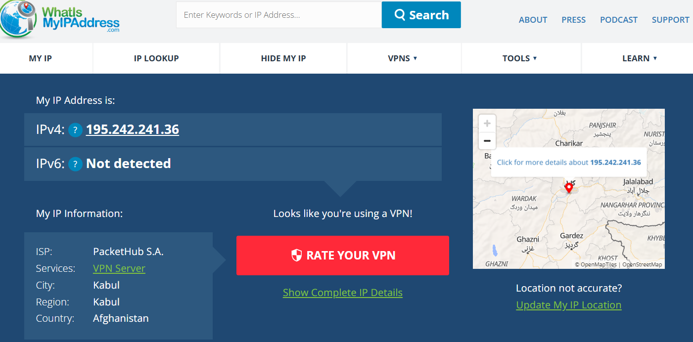
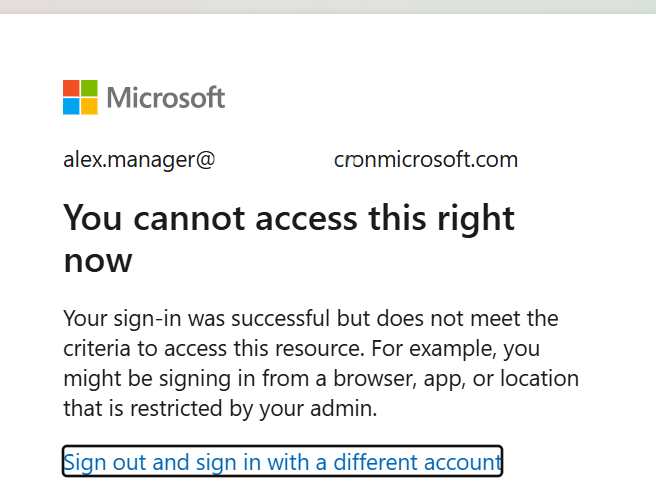

# Lab: Block High-Risk Countries with Conditional Access 🌍

## 🎯 Objective
Demonstrate how to create and test a Microsoft Entra **Conditional Access policy** that blocks sign-ins from high-risk countries. This lab simulates an attacker logging in from a foreign location using **NordVPN**, and shows how the policy detects and blocks the attempt.

---

## 🛠️ Prerequisites
- Microsoft Entra tenant (with Conditional Access available)
- Test user account (⚠️ **Do not** use your Global Admin account)
- NordVPN (or any VPN that lets you select countries/regions)
- Browser with **Incognito/Private mode**

---

## 🔧 Steps

### Step 1 – Create Named Location
1. Go to **Microsoft Entra admin center** → **Security → Conditional Access → Named locations**.
2. Click **+ New location** → Name: `High-Risk Countries`.
3. Select **Countries/Regions**.
4. Add one or more countries you want to block (e.g., North Korea, Iran).
5. Save.

---

### Step 2 – Create the Policy
1. Navigate to **Conditional Access → Policies → + New policy**.
2. Name: `Block High-Risk Countries`.
3. **Assignments**
   - **Users**: Select only your **test user**.
   - **Target resources**: Select **All cloud apps**.
   - **Conditions → Locations**:
     - Configure = **Yes**.
     - Include = **Selected locations** → choose `High-Risk Countries`.
4. **Access controls → Grant**:
   - Select **Block access**.
5. **Enable policy**: Start with **Report-only**.

---

### Step 3 – Test the Policy with VPN
1. Open NordVPN → Connect to a server in one of your selected countries.
2. Verify IP with [https://whatismyipaddress.com](https://whatismyipaddress.com).
3. Open a new **Incognito browser**.
4. Log in as your test user at [https://portal.office.com](https://portal.office.com).
5. Review the result:
   - If **Report-only** → Login succeeds, but the policy shows **Report-only: Failure** in sign-in logs.
   - If **On** → Login fails with “Access blocked by Conditional Access policy.”

---

### Step 4 – Validate in Sign-in Logs
1. Go to **Entra ID → Monitoring → Sign-in logs**.
2. Click on the test sign-in attempt.
3. Review the following tabs:
   - **Location** → Confirms VPN country/region.
   - **Conditional Access** → Shows `High-Risk Countries` applied.
   - **Report-only** → Shows **Failure** if login would have been blocked.

---

## 📸 Screenshots

### 1. Policy Creation

### 2. VPN Connected

### 3. IP Verification

### 4. Sign-in Logs

### 5. Blocked Login

 
---

## ✅ Outcome
- Sign-ins originating from blocked countries are denied.
- You verified enforcement using a VPN.
- Conditional Access policies provide geographic restrictions to reduce attack surface.

---

## 🔎 Notes
- Always exclude your **Global Admin** account from CA policies to avoid lockout.
- Combine with **MFA for external users** for layered defense.
- VPN IP ranges may sometimes resolve to “Unknown” locations — try switching servers if location is missing in logs.
